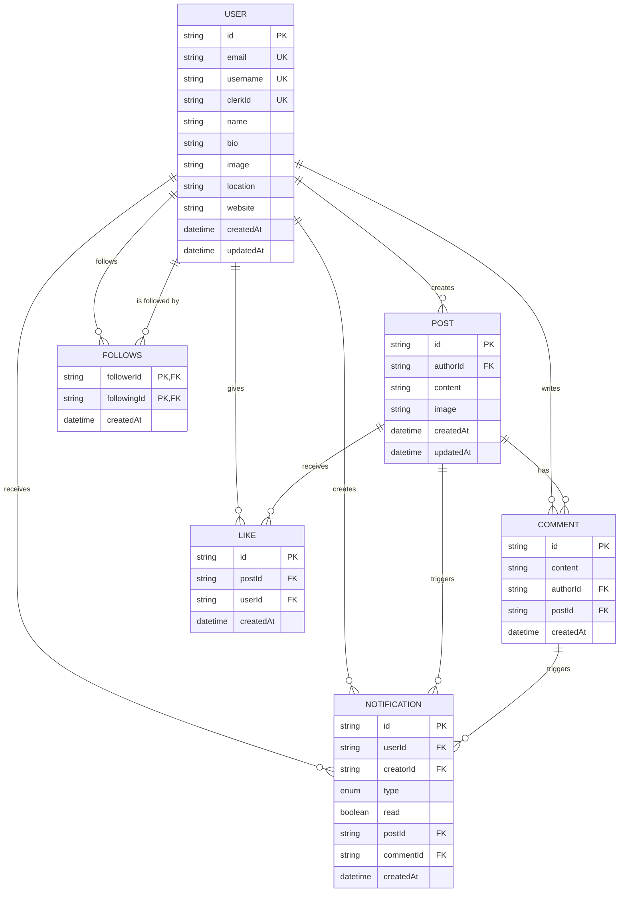

# Diagramme ERD (Entity-Relationship Diagram)

## 📊 Diagramme de Relations



## 🔗 Relations Détaillées

### 1. User → Post (1:N)
**Cardinalité**: Un utilisateur peut créer plusieurs posts
```
User (1) ──creates──> (N) Post
```
- **Foreign Key**: `Post.authorId` → `User.id`
- **Cascade**: DELETE User → DELETE Posts

---

### 2. User → Comment (1:N)
**Cardinalité**: Un utilisateur peut écrire plusieurs commentaires
```
User (1) ──writes──> (N) Comment
```
- **Foreign Key**: `Comment.authorId` → `User.id`
- **Cascade**: DELETE User → DELETE Comments

---

### 3. User → Like (1:N)
**Cardinalité**: Un utilisateur peut donner plusieurs likes
```
User (1) ──gives──> (N) Like
```
- **Foreign Key**: `Like.userId` → `User.id`
- **Cascade**: DELETE User → DELETE Likes

---

### 4. Post → Comment (1:N)
**Cardinalité**: Un post peut avoir plusieurs commentaires
```
Post (1) ──has──> (N) Comment
```
- **Foreign Key**: `Comment.postId` → `Post.id`
- **Cascade**: DELETE Post → DELETE Comments

---

### 5. Post → Like (1:N)
**Cardinalité**: Un post peut recevoir plusieurs likes
```
Post (1) ──receives──> (N) Like
```
- **Foreign Key**: `Like.postId` → `Post.id`
- **Cascade**: DELETE Post → DELETE Likes

---

### 6. User ↔ User via Follows (M:N)
**Cardinalité**: Un utilisateur peut suivre/être suivi par plusieurs utilisateurs
```
User (follower) ──follows──> User (following)
```
- **Table pivot**: `Follows`
- **Clé composite**: `[followerId, followingId]`
- **Foreign Keys**:
  - `Follows.followerId` → `User.id`
  - `Follows.followingId` → `User.id`
- **Cascade**: DELETE User → DELETE Follows (bidirectionnel)

---

### 7. User → Notification (1:N) - Destinataire
**Cardinalité**: Un utilisateur peut recevoir plusieurs notifications
```
User (1) ──receives──> (N) Notification
```
- **Foreign Key**: `Notification.userId` → `User.id`
- **Relation nommée**: `userNotifications`
- **Cascade**: DELETE User → DELETE Notifications

---

### 8. User → Notification (1:N) - Créateur
**Cardinalité**: Un utilisateur peut créer plusieurs notifications
```
User (1) ──creates──> (N) Notification
```
- **Foreign Key**: `Notification.creatorId` → `User.id`
- **Relation nommée**: `notificationCreator`
- **Cascade**: DELETE User → DELETE Notifications

---

### 9. Post → Notification (1:N)
**Cardinalité**: Un post peut déclencher plusieurs notifications
```
Post (1) ──triggers──> (N) Notification
```
- **Foreign Key**: `Notification.postId` → `Post.id` (nullable)
- **Cascade**: DELETE Post → DELETE Notifications

---

### 10. Comment → Notification (1:N)
**Cardinalité**: Un commentaire peut déclencher plusieurs notifications
```
Comment (1) ──triggers──> (N) Notification
```
- **Foreign Key**: `Notification.commentId` → `Comment.id` (nullable)
- **Cascade**: DELETE Comment → DELETE Notifications

## 📋 Table des Cardinalités

| Relation | From | To | Type | Notes |
|----------|------|-----|------|-------|
| creates | User | Post | 1:N | Un user → plusieurs posts |
| writes | User | Comment | 1:N | Un user → plusieurs comments |
| gives | User | Like | 1:N | Un user → plusieurs likes |
| has | Post | Comment | 1:N | Un post → plusieurs comments |
| receives (likes) | Post | Like | 1:N | Un post → plusieurs likes |
| follows | User | User | M:N | Via table Follows |
| receives (notifs) | User | Notification | 1:N | Un user → plusieurs notifs |
| creates (notifs) | User | Notification | 1:N | Un user crée plusieurs notifs |
| triggers (post) | Post | Notification | 1:N | Un post → plusieurs notifs |
| triggers (comment) | Comment | Notification | 1:N | Un comment → plusieurs notifs |

## 🔑 Clés et Contraintes

### Clés Primaires (PK)

| Table | Clé Primaire | Type |
|-------|-------------|------|
| User | id | CUID |
| Post | id | CUID |
| Comment | id | CUID |
| Like | id | CUID |
| Follows | [followerId, followingId] | Composite |
| Notification | id | CUID |

### Clés Étrangères (FK)

| Table | Champ | Référence | Cascade |
|-------|-------|-----------|---------|
| Post | authorId | User.id | DELETE |
| Comment | authorId | User.id | DELETE |
| Comment | postId | Post.id | DELETE |
| Like | userId | User.id | DELETE |
| Like | postId | Post.id | DELETE |
| Follows | followerId | User.id | DELETE |
| Follows | followingId | User.id | DELETE |
| Notification | userId | User.id | DELETE |
| Notification | creatorId | User.id | DELETE |
| Notification | postId | Post.id | DELETE |
| Notification | commentId | Comment.id | DELETE |

### Contraintes Uniques (UK)

| Table | Champ(s) | Signification |
|-------|----------|---------------|
| User | email | Email unique par utilisateur |
| User | username | Nom d'utilisateur unique |
| User | clerkId | ID Clerk unique |
| Like | [userId, postId] | Un user ne peut liker un post qu'une fois |
| Follows | [followerId, followingId] | Un user ne peut suivre un autre qu'une fois |

## 🎨 Schéma Visuel Simplifié

```
                    ┌─────────────┐
                    │    USER     │
                    └──────┬──────┘
                           │
         ┌─────────────────┼─────────────────┐
         │                 │                 │
         ▼                 ▼                 ▼
    ┌────────┐       ┌─────────┐      ┌──────────┐
    │  POST  │       │ COMMENT │      │   LIKE   │
    └────┬───┘       └────┬────┘      └──────────┘
         │                │
         └────────┬───────┘
                  ▼
           ┌──────────────┐
           │ NOTIFICATION │
           └──────────────┘

         ┌─────────────┐
         │   FOLLOWS   │  (Self-relation on User)
         └─────────────┘
```

## 🔄 Flux de Cascade

### Suppression d'un User
```
DELETE User
  ├─> DELETE Posts
  │     ├─> DELETE Comments (sur ces posts)
  │     ├─> DELETE Likes (sur ces posts)
  │     └─> DELETE Notifications (liées à ces posts)
  ├─> DELETE Comments (écrits par ce user)
  │     └─> DELETE Notifications (liées à ces comments)
  ├─> DELETE Likes (donnés par ce user)
  ├─> DELETE Follows (en tant que follower)
  ├─> DELETE Follows (en tant que following)
  ├─> DELETE Notifications (reçues par ce user)
  └─> DELETE Notifications (créées par ce user)
```

### Suppression d'un Post
```
DELETE Post
  ├─> DELETE Comments
  │     └─> DELETE Notifications (liées aux comments)
  ├─> DELETE Likes
  └─> DELETE Notifications (liées au post)
```

## 📊 Statistiques de Relations

- **Total de relations**: 10 relations distinctes
- **Relations 1:N**: 8
- **Relations M:N**: 1 (via table pivot)
- **Relations auto-référencées**: 1 (Follows)
- **Relations bidirectionnelles**: 2 (User ↔ Notification)

## 🔍 Index Optimisés

### Index composites pour performance

```sql
-- Comment
INDEX idx_comment_author_post ON Comment(authorId, postId)

-- Like
INDEX idx_like_user_post ON Like(userId, postId)

-- Follows
INDEX idx_follows ON Follows(followerId, followingId)

-- Notification
INDEX idx_notification ON Notification(userId, createdAt)
```

## 📝 Notes importantes

1. **Pas de relation circulaire**: Le schéma évite les dépendances circulaires
2. **Cascade intégral**: Toutes les suppressions sont propagées
3. **Intégrité référentielle**: Garantie par les foreign keys
4. **Optimisation**: Index sur toutes les foreign keys et requêtes fréquentes
5. **Normalisation**: 3NF (Third Normal Form) respectée

---

**Voir aussi**:
- [Schéma de base de données](./00-schema.md)
- [Guide de migration](./02-migrations.md)
