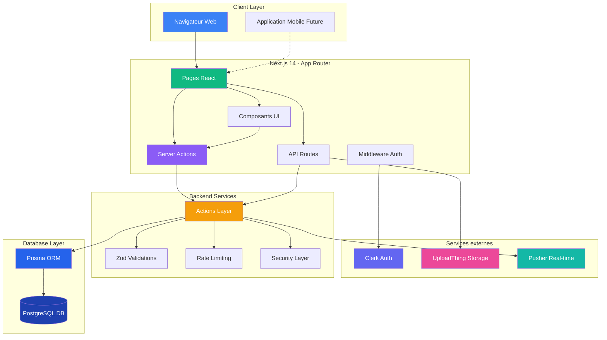
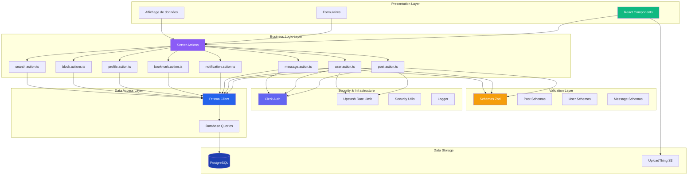
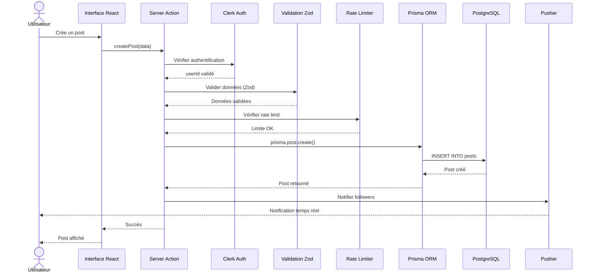
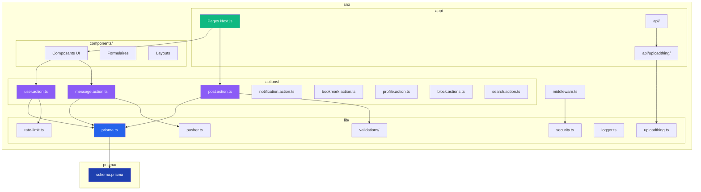
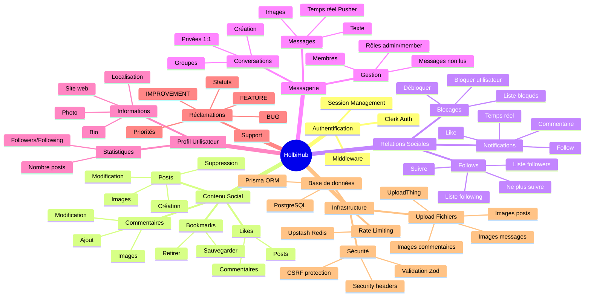
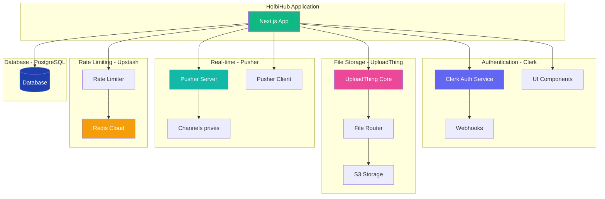
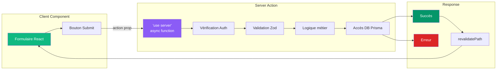
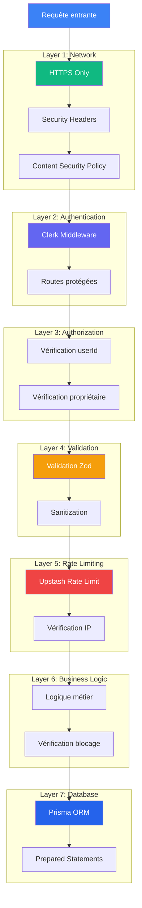
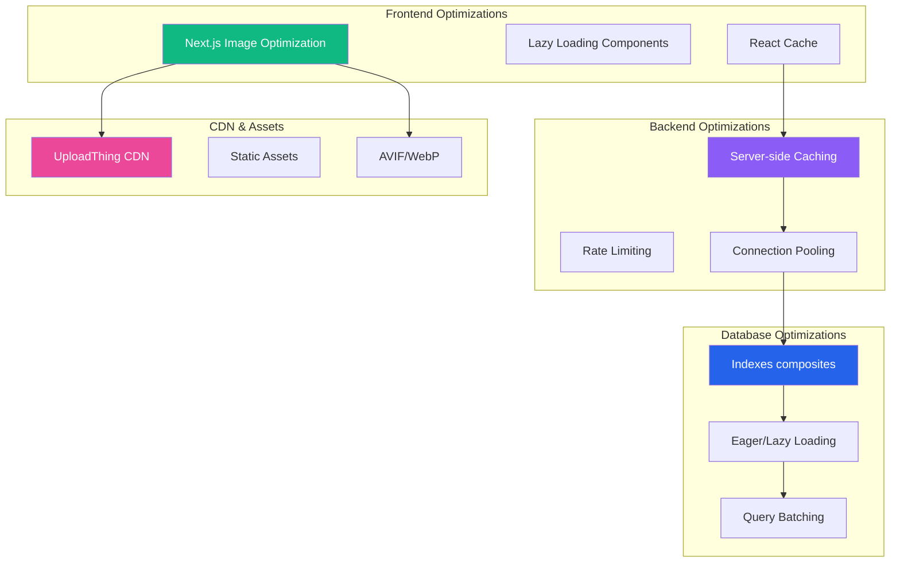

# Schémas Mermaid - Architecture de l'Application

## 1. Architecture Globale de HolbiHub

## 2. Architecture en Couches (Layered Architecture)

## 3. Flux d'une Requête Complète

## 4. Structure du Projet

## 5. Modules et Fonctionnalités

## 6. Services Externes et Intégrations

## 7. Pattern de Server Actions (Next.js 14)

## 8. Sécurité Multi-Couches

## 9. Performance et Optimisations

