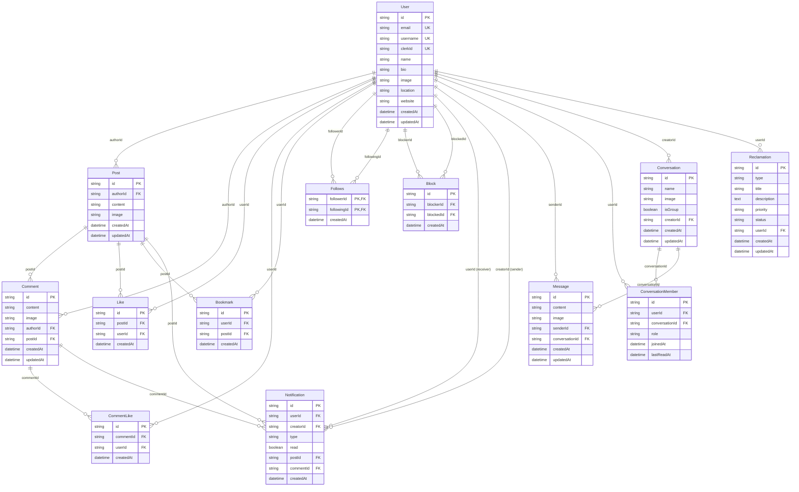
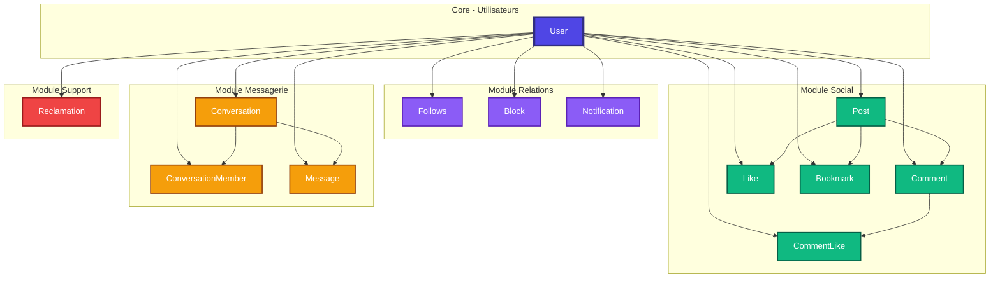
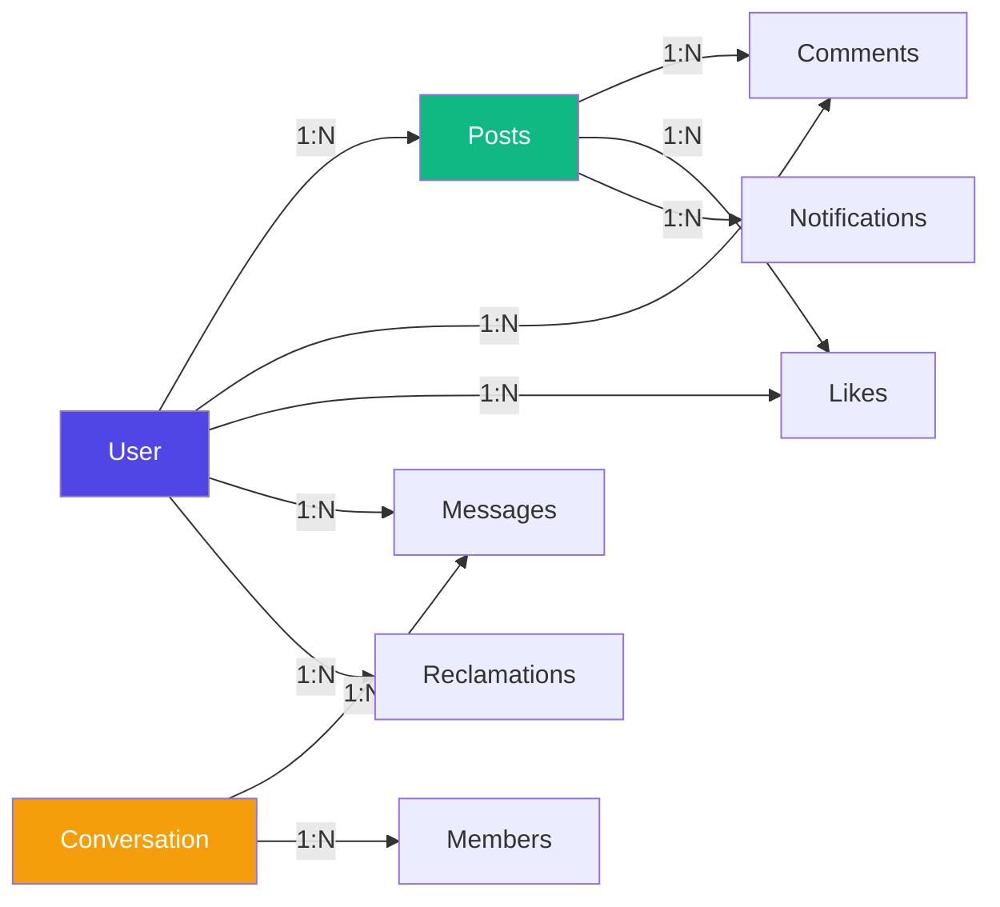
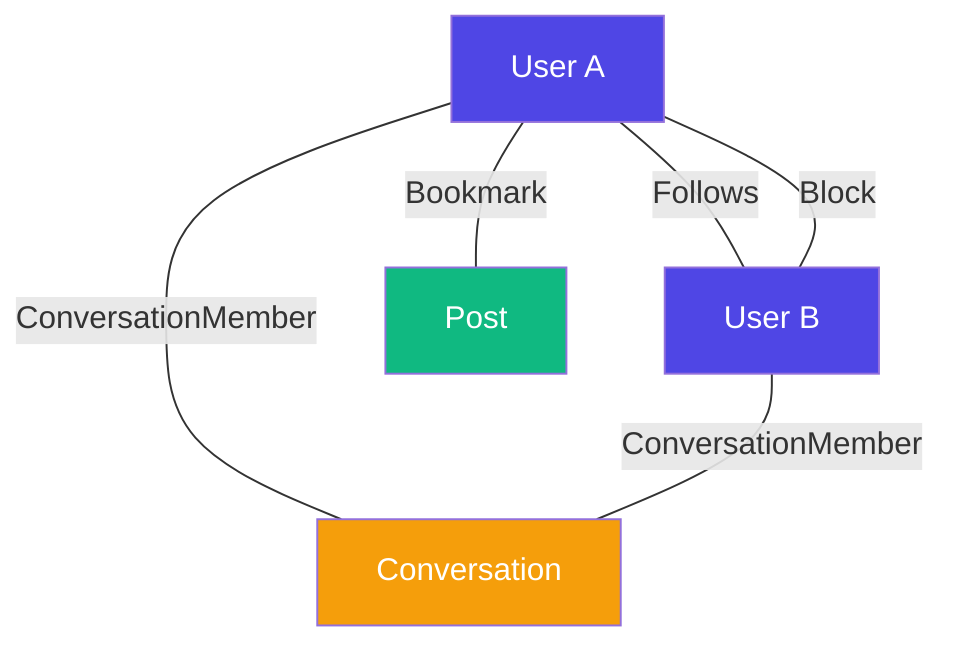
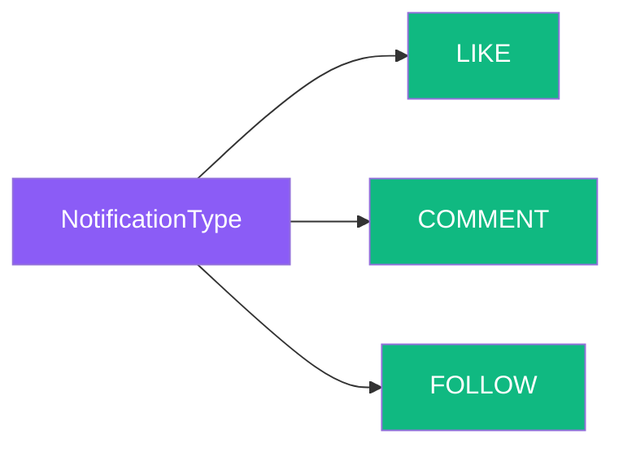
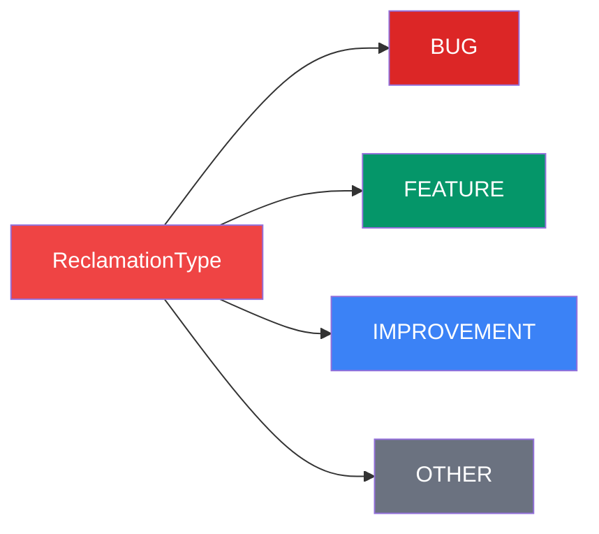
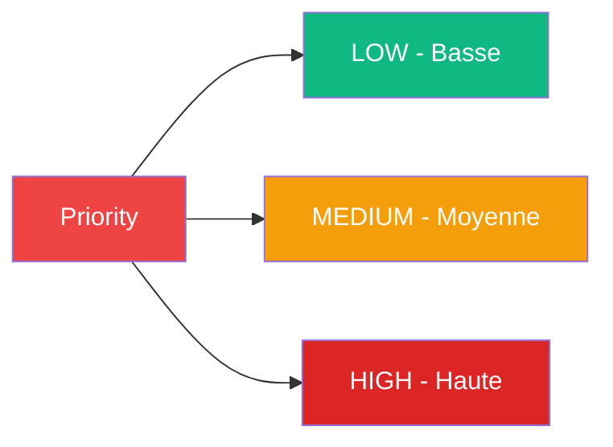
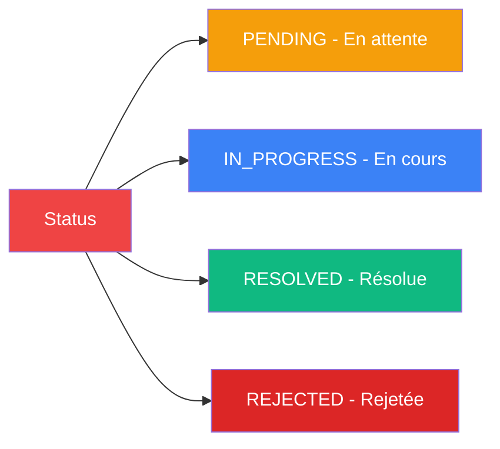
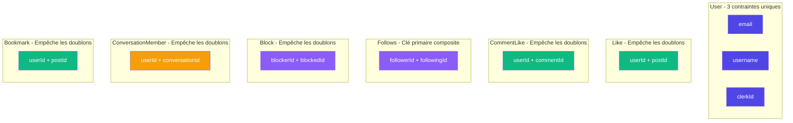
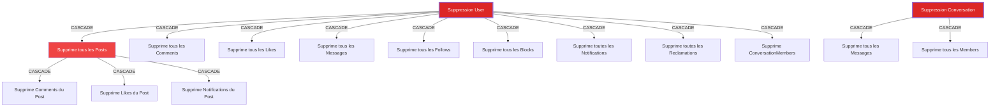

# Schémas Mermaid - Base de Données Complète

## 1. Diagramme Entité-Relation Complet

## 2. Vue d'Ensemble des Modules

## 3. Relations par Type

### 3.1 Relations One-to-Many

### 3.2 Relations Many-to-Many

## 4. Enums et Types

### 4.1 NotificationType

### 4.2 ReclamationType

### 4.3 ReclamationPriority

### 4.4 ReclamationStatus

## 5. Index et Optimisations

### Index Composites

| Modèle | Champs | Type | Raison |
|--------|--------|------|---------|
| Comment | `[authorId, postId]` | Composite | Requêtes de commentaires par auteur et post |
| Like | `[userId, postId]` | Composite + Unique | Empêche les doublons, optimise les requêtes |
| CommentLike | `[userId, commentId]` | Composite + Unique | Empêche les doublons, optimise les requêtes |
| Follows | `[followerId, followingId]` | Composite + PK | Clé primaire composite, empêche les doublons |
| Block | `[blockerId]`, `[blockedId]` | Simple | Recherche rapide des blocages |
| Notification | `[userId, createdAt]` | Composite | Récupération chronologique des notifications |
| ConversationMember | `[userId, conversationId]` | Composite + Unique | Empêche les doublons de membres |
| Message | `[conversationId, createdAt]` | Composite | Messages chronologiques par conversation |
| Reclamation | `[userId, createdAt]`, `[status, createdAt]` | Composite | Réclamations par utilisateur et par statut |
| Conversation | `[isGroup]`, `[creatorId]` | Simple | Filtrage par type et créateur |

### Contraintes d'Unicité

## 6. Cascade de Suppression

Toutes les relations utilisent `onDelete: Cascade` sauf indication contraire :

## 7. Statistiques de la Base de Données

| Métrique | Valeur |
|----------|--------|
| Nombre total de modèles | 13 |
| Modèles principaux | User, Post, Conversation |
| Relations One-to-Many | 15 |
| Relations Many-to-Many | 4 |
| Enums définis | 4 |
| Index composites | 12 |
| Contraintes d'unicité | 10 |
| Champs timestamp | 26 (createdAt/updatedAt) |
