# Schémas Mermaid - Flux de Requêtes et Parcours Utilisateur

## 1. Flux d'Authentification (Clerk)

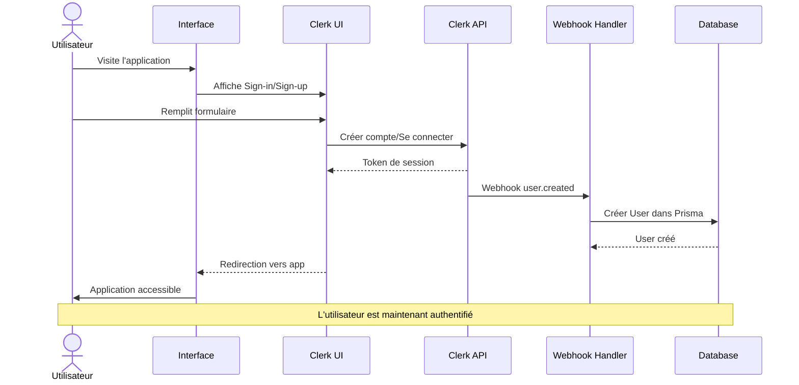

## 2. Flux de Création de Post

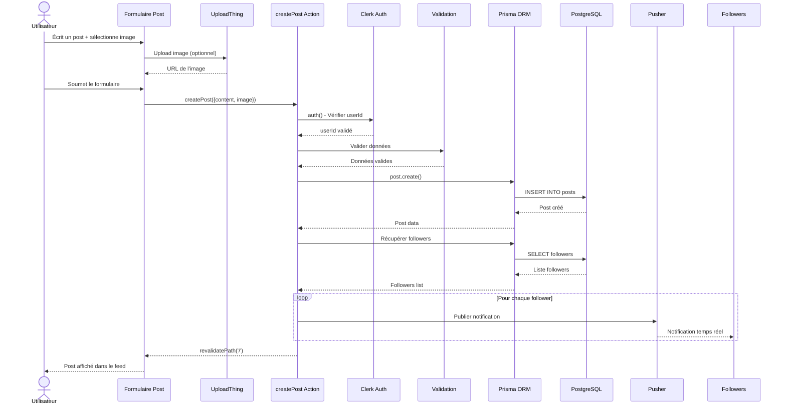

## 3. Flux de Messagerie en Temps Réel

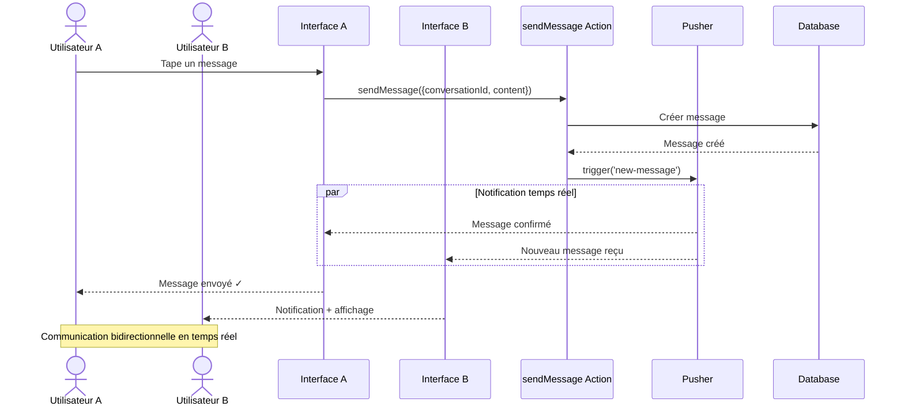

## 4. Flux de Notification

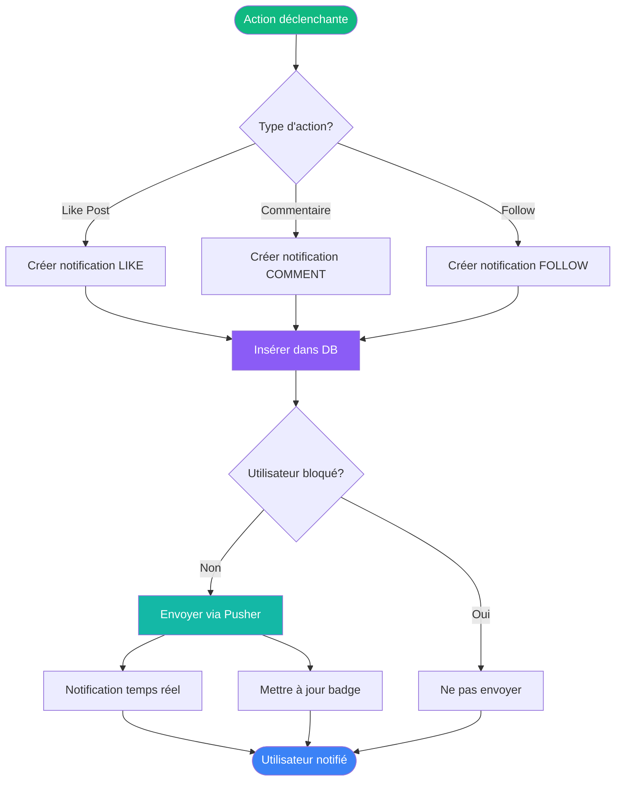

## 5. Flux de Recherche d'Utilisateurs

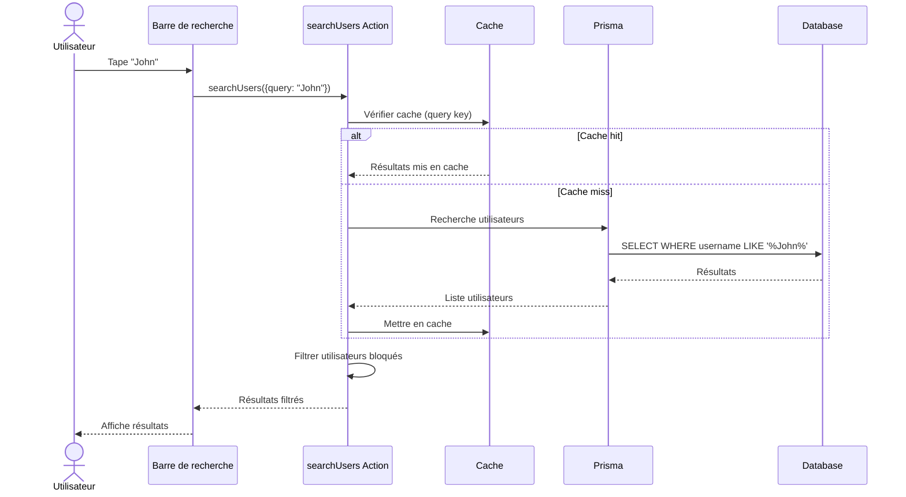

## 6. Flux de Like/Unlike Post

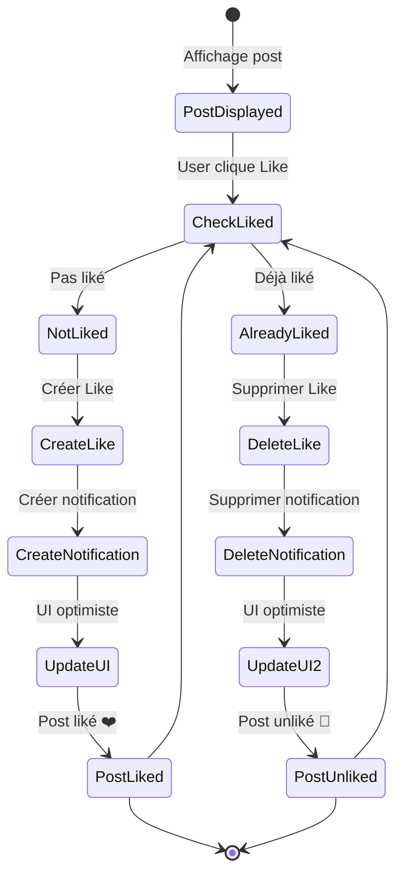

## 7. Flux de Blocage d'Utilisateur

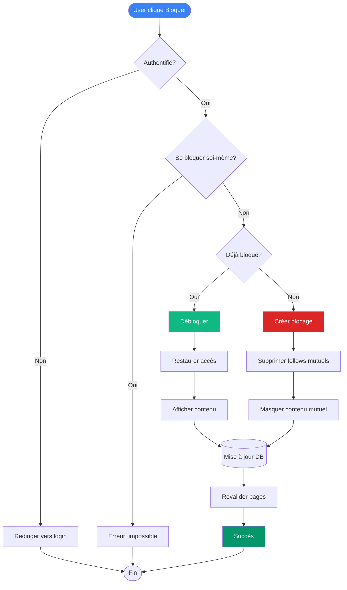

## 8. Flux de Conversation (1:1 et Groupe)

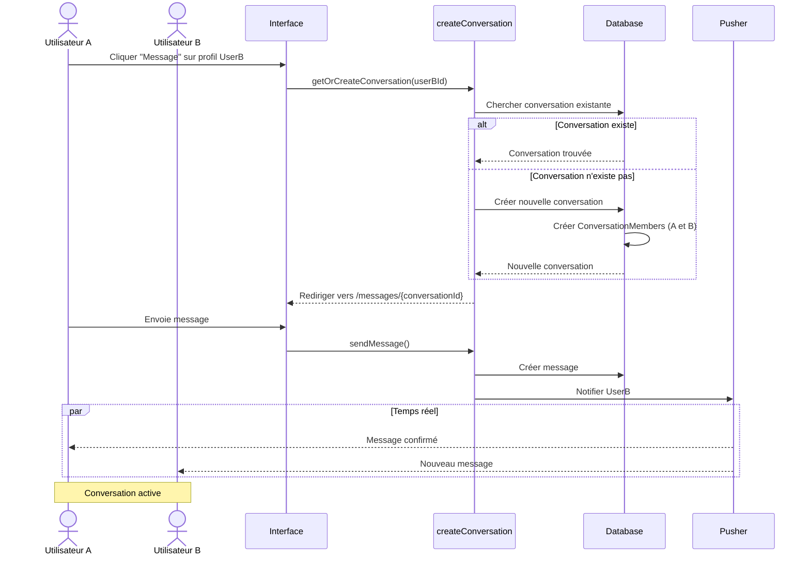

## 9. Flux de Bookmark

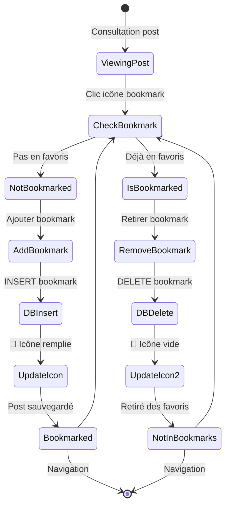

## 10. Flux de Upload d'Image

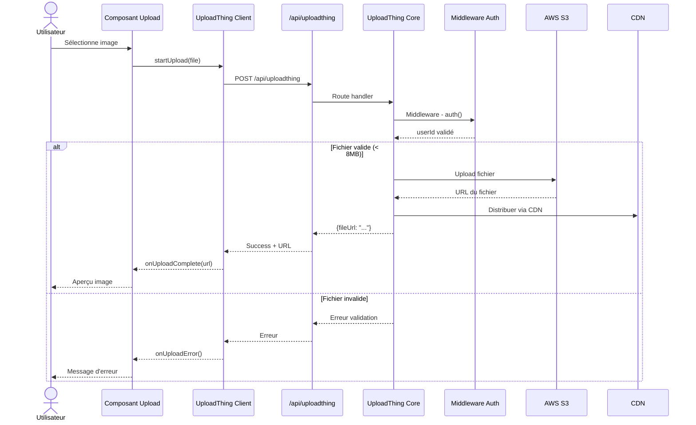

## 11. Flux de Réclamation

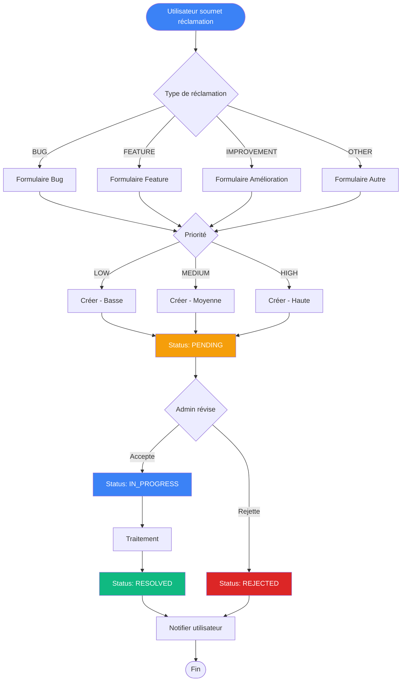

## 12. Flux de Feed Personnalisé

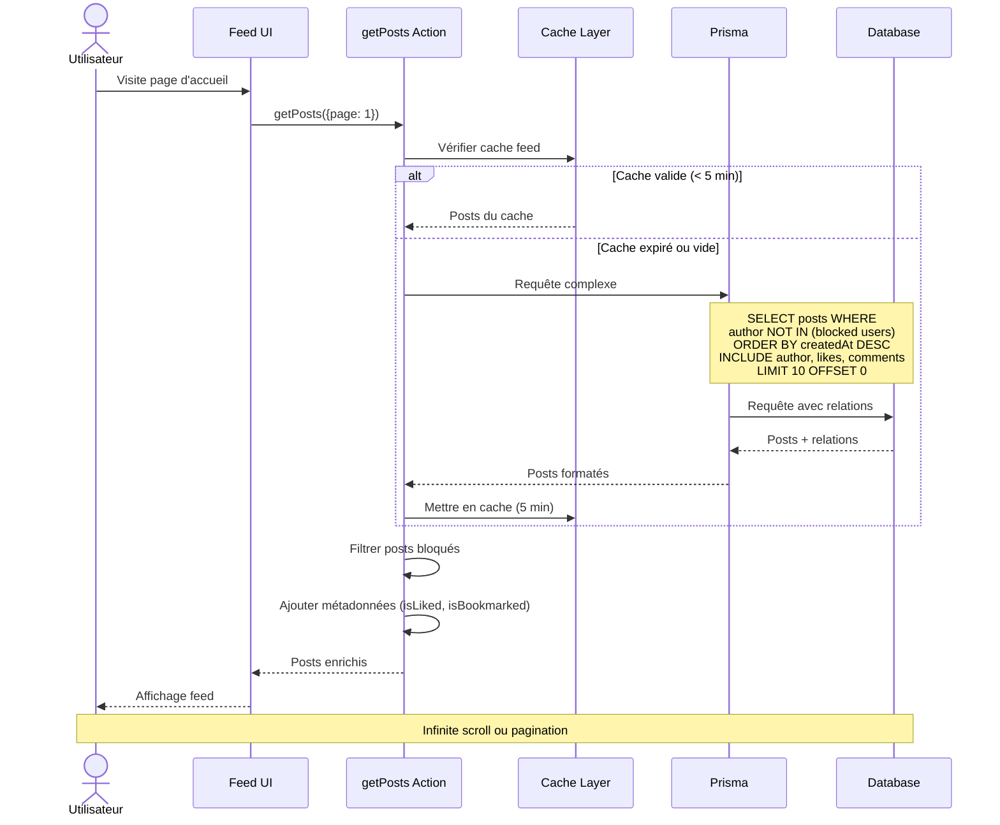

## 13. Parcours Complet - Créer un Post avec Image

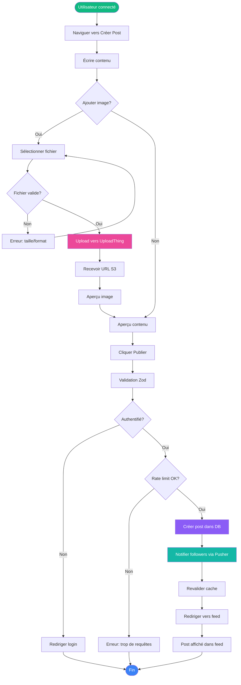

## 14. Gestion d'Erreurs et Retry

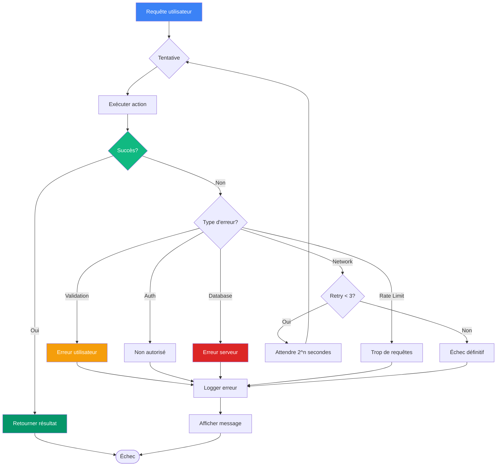

## 15. Parcours de Messagerie Complète

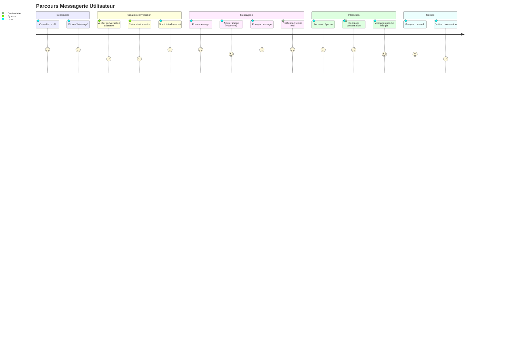

## 16. Matrice des Actions et Permissions

| Action | Auth requis | Rate Limit | Validation | Notification | Real-time |
|--------|-------------|------------|------------|--------------|-----------|
| Créer Post | ✅ | ✅ (10/min) | Zod | Followers | ✅ Pusher |
| Liker Post | ✅ | ✅ (30/min) | Simple | Auteur post | ✅ Pusher |
| Commenter | ✅ | ✅ (15/min) | Zod | Auteur post | ✅ Pusher |
| Follow User | ✅ | ✅ (20/min) | Simple | Utilisateur | ✅ Pusher |
| Envoyer Message | ✅ | ✅ (20/min) | Zod | Destinataire | ✅ Pusher |
| Upload Image | ✅ | ✅ (5/min) | UploadThing | - | - |
| Bloquer User | ✅ | ✅ (10/min) | Simple | - | - |
| Créer Réclamation | ✅ | ✅ (3/hour) | Zod | Admins | - |
| Rechercher | ✅ | ✅ (60/min) | Simple | - | - |
| Bookmark | ✅ | ✅ (30/min) | Simple | - | - |
