# Schémas Mermaid - Flux de Requêtes et Parcours Utilisateur

## 1. Flux d'Authentification (Clerk)

```mermaid
sequenceDiagram
    actor User as Utilisateur
    participant UI as Interface
    participant ClerkUI as Clerk UI
    participant ClerkAPI as Clerk API
    participant Webhook as Webhook Handler
    participant DB as Database

    User->>UI: Visite l'application
    UI->>ClerkUI: Affiche Sign-in/Sign-up
    User->>ClerkUI: Remplit formulaire
    ClerkUI->>ClerkAPI: Créer compte/Se connecter
    ClerkAPI-->>ClerkUI: Token de session

    ClerkAPI->>Webhook: Webhook user.created
    Webhook->>DB: Créer User dans Prisma
    DB-->>Webhook: User créé

    ClerkUI-->>UI: Redirection vers app
    UI->>User: Application accessible

    Note over User,DB: L'utilisateur est maintenant authentifié
```

## 2. Flux de Création de Post

```mermaid
sequenceDiagram
    actor User as Utilisateur
    participant UI as Formulaire Post
    participant Upload as UploadThing
    participant Action as createPost Action
    participant Auth as Clerk Auth
    participant Zod as Validation
    participant Prisma as Prisma ORM
    participant DB as PostgreSQL
    participant Pusher as Pusher
    participant Followers as Followers

    User->>UI: Écrit un post + sélectionne image
    UI->>Upload: Upload image (optionnel)
    Upload-->>UI: URL de l'image

    User->>UI: Soumet le formulaire
    UI->>Action: createPost({content, image})

    Action->>Auth: auth() - Vérifier userId
    Auth-->>Action: userId validé

    Action->>Zod: Valider données
    Zod-->>Action: Données valides

    Action->>Prisma: post.create()
    Prisma->>DB: INSERT INTO posts
    DB-->>Prisma: Post créé
    Prisma-->>Action: Post data

    Action->>Prisma: Récupérer followers
    Prisma->>DB: SELECT followers
    DB-->>Prisma: Liste followers
    Prisma-->>Action: Followers list

    loop Pour chaque follower
        Action->>Pusher: Publier notification
        Pusher-->>Followers: Notification temps réel
    end

    Action-->>UI: revalidatePath('/')
    UI-->>User: Post affiché dans le feed
```

## 3. Flux de Messagerie en Temps Réel

```mermaid
sequenceDiagram
    actor UserA as Utilisateur A
    actor UserB as Utilisateur B
    participant UIA as Interface A
    participant UIB as Interface B
    participant Action as sendMessage Action
    participant Pusher as Pusher
    participant DB as Database

    UserA->>UIA: Tape un message
    UIA->>Action: sendMessage({conversationId, content})

    Action->>DB: Créer message
    DB-->>Action: Message créé

    Action->>Pusher: trigger('new-message')

    par Notification temps réel
        Pusher-->>UIA: Message confirmé
        Pusher-->>UIB: Nouveau message reçu
    end

    UIA-->>UserA: Message envoyé ✓
    UIB-->>UserB: Notification + affichage

    Note over UserA,UserB: Communication bidirectionnelle en temps réel
```

## 4. Flux de Notification

```mermaid
flowchart TB
    Start([Action déclenchante])

    Start --> CheckType{Type d'action?}

    CheckType -->|Like Post| LikePost[Créer notification LIKE]
    CheckType -->|Commentaire| Comment[Créer notification COMMENT]
    CheckType -->|Follow| Follow[Créer notification FOLLOW]

    LikePost --> CreateNotif[Insérer dans DB]
    Comment --> CreateNotif
    Follow --> CreateNotif

    CreateNotif --> CheckBlocked{Utilisateur bloqué?}

    CheckBlocked -->|Oui| Skip[Ne pas envoyer]
    CheckBlocked -->|Non| SendPusher[Envoyer via Pusher]

    SendPusher --> RealTime[Notification temps réel]
    SendPusher --> Badge[Mettre à jour badge]

    RealTime --> End([Utilisateur notifié])
    Badge --> End
    Skip --> End

    style Start fill:#10B981,color:#fff
    style CreateNotif fill:#8B5CF6,color:#fff
    style SendPusher fill:#14B8A6,color:#fff
    style End fill:#3B82F6,color:#fff
```

## 5. Flux de Recherche d'Utilisateurs

```mermaid
sequenceDiagram
    actor User as Utilisateur
    participant UI as Barre de recherche
    participant Action as searchUsers Action
    participant Cache as Cache
    participant Prisma as Prisma
    participant DB as Database

    User->>UI: Tape "John"
    UI->>Action: searchUsers({query: "John"})

    Action->>Cache: Vérifier cache (query key)

    alt Cache hit
        Cache-->>Action: Résultats mis en cache
    else Cache miss
        Action->>Prisma: Recherche utilisateurs
        Prisma->>DB: SELECT WHERE username LIKE '%John%'
        DB-->>Prisma: Résultats
        Prisma-->>Action: Liste utilisateurs
        Action->>Cache: Mettre en cache
    end

    Action->>Action: Filtrer utilisateurs bloqués
    Action-->>UI: Résultats filtrés
    UI-->>User: Affiche résultats
```

## 6. Flux de Like/Unlike Post

```mermaid
stateDiagram-v2
    [*] --> PostDisplayed: Affichage post

    PostDisplayed --> CheckLiked: User clique Like

    CheckLiked --> AlreadyLiked: Déjà liké
    CheckLiked --> NotLiked: Pas liké

    NotLiked --> CreateLike: Créer Like
    CreateLike --> CreateNotification: Créer notification
    CreateNotification --> UpdateUI: UI optimiste
    UpdateUI --> PostLiked: Post liké ❤️

    AlreadyLiked --> DeleteLike: Supprimer Like
    DeleteLike --> DeleteNotification: Supprimer notification
    DeleteNotification --> UpdateUI2: UI optimiste
    UpdateUI2 --> PostUnliked: Post unliké 🤍

    PostLiked --> CheckLiked
    PostUnliked --> CheckLiked

    PostLiked --> [*]
    PostUnliked --> [*]
```

## 7. Flux de Blocage d'Utilisateur

```mermaid
flowchart TD
    Start([User clique Bloquer])

    Start --> Auth{Authentifié?}
    Auth -->|Non| Redirect[Rediriger vers login]
    Auth -->|Oui| CheckSelf{Se bloquer soi-même?}

    CheckSelf -->|Oui| Error1[Erreur: impossible]
    CheckSelf -->|Non| CheckExisting{Déjà bloqué?}

    CheckExisting -->|Oui| Unblock[Débloquer]
    CheckExisting -->|Non| Block[Créer blocage]

    Block --> RemoveFollow[Supprimer follows mutuels]
    Unblock --> RestoreAccess[Restaurer accès]

    RemoveFollow --> HideContent[Masquer contenu mutuel]
    RestoreAccess --> ShowContent[Afficher contenu]

    HideContent --> UpdateDB[(Mise à jour DB)]
    ShowContent --> UpdateDB

    UpdateDB --> Revalidate[Revalider pages]
    Revalidate --> Success[Succès]

    Error1 --> End([Fin])
    Redirect --> End
    Success --> End

    style Start fill:#3B82F6,color:#fff
    style Block fill:#DC2626,color:#fff
    style Unblock fill:#10B981,color:#fff
    style Success fill:#059669,color:#fff
```

## 8. Flux de Conversation (1:1 et Groupe)

## 9. Flux de Bookmark

```mermaid
stateDiagram-v2
    [*] --> ViewingPost: Consultation post

    ViewingPost --> CheckBookmark: Clic icône bookmark

    CheckBookmark --> IsBookmarked: Déjà en favoris
    CheckBookmark --> NotBookmarked: Pas en favoris

    NotBookmarked --> AddBookmark: Ajouter bookmark
    AddBookmark --> DBInsert: INSERT bookmark
    DBInsert --> UpdateIcon: 🔖 Icône remplie
    UpdateIcon --> Bookmarked: Post sauvegardé

    IsBookmarked --> RemoveBookmark: Retirer bookmark
    RemoveBookmark --> DBDelete: DELETE bookmark
    DBDelete --> UpdateIcon2: 🔖 Icône vide
    UpdateIcon2 --> NotInBookmarks: Retiré des favoris

    Bookmarked --> CheckBookmark
    NotInBookmarks --> CheckBookmark

    Bookmarked --> [*]: Navigation
    NotInBookmarks --> [*]: Navigation
```

## 10. Flux de Upload d'Image

```mermaid
sequenceDiagram
    actor User as Utilisateur
    participant UI as Composant Upload
    participant UT as UploadThing Client
    participant API as /api/uploadthing
    participant Core as UploadThing Core
    participant MW as Middleware Auth
    participant S3 as AWS S3
    participant CDN as CDN

    User->>UI: Sélectionne image
    UI->>UT: startUpload(file)

    UT->>API: POST /api/uploadthing
    API->>Core: Route handler
    Core->>MW: Middleware - auth()

    MW-->>Core: userId validé

    alt Fichier valide (< 8MB)
        Core->>S3: Upload fichier
        S3-->>Core: URL du fichier
        Core->>CDN: Distribuer via CDN
        Core-->>API: {fileUrl: "..."}
        API-->>UT: Success + URL
        UT-->>UI: onUploadComplete(url)
        UI-->>User: Aperçu image
    else Fichier invalide
        Core-->>API: Erreur validation
        API-->>UT: Erreur
        UT-->>UI: onUploadError()
        UI-->>User: Message d'erreur
    end
```

## 11. Flux de Réclamation

## 12. Flux de Feed Personnalisé

```mermaid
sequenceDiagram
    actor User as Utilisateur
    participant UI as Feed UI
    participant Action as getPosts Action
    participant Cache as Cache Layer
    participant Prisma as Prisma
    participant DB as Database

    User->>UI: Visite page d'accueil
    UI->>Action: getPosts({page: 1})

    Action->>Cache: Vérifier cache feed

    alt Cache valide (< 5 min)
        Cache-->>Action: Posts du cache
    else Cache expiré ou vide
        Action->>Prisma: Requête complexe

        Note over Prisma,DB: SELECT posts WHERE<br/>author NOT IN (blocked users)<br/>ORDER BY createdAt DESC<br/>INCLUDE author, likes, comments<br/>LIMIT 10 OFFSET 0

        Prisma->>DB: Requête avec relations
        DB-->>Prisma: Posts + relations
        Prisma-->>Action: Posts formatés

        Action->>Cache: Mettre en cache (5 min)
    end

    Action->>Action: Filtrer posts bloqués
    Action->>Action: Ajouter métadonnées (isLiked, isBookmarked)

    Action-->>UI: Posts enrichis
    UI-->>User: Affichage feed

    Note over User,DB: Infinite scroll ou pagination
```

## 13. Parcours Complet - Créer un Post avec Image

## 14. Gestion d'Erreurs et Retry

```mermaid
flowchart TD
    Request[Requête utilisateur] --> Try{Tentative}

    Try --> Execute[Exécuter action]

    Execute --> Success{Succès?}

    Success -->|Oui| Return[Retourner résultat]
    Success -->|Non| ErrorType{Type d'erreur?}

    ErrorType -->|Network| Retry{Retry < 3?}
    ErrorType -->|Validation| UserError[Erreur utilisateur]
    ErrorType -->|Auth| Unauthorized[Non autorisé]
    ErrorType -->|Database| ServerError[Erreur serveur]
    ErrorType -->|Rate Limit| TooManyRequests[Trop de requêtes]

    Retry -->|Oui| Wait[Attendre 2^n secondes]
    Wait --> Try

    Retry -->|Non| Failed[Échec définitif]

    UserError --> LogError[Logger erreur]
    Unauthorized --> LogError
    ServerError --> LogError
    TooManyRequests --> LogError
    Failed --> LogError

    LogError --> DisplayError[Afficher message]

    Return --> End([Succès])
    DisplayError --> End([Échec])

    style Request fill:#3B82F6,color:#fff
    style Success fill:#10B981,color:#fff
    style UserError fill:#F59E0B,color:#fff
    style ServerError fill:#DC2626,color:#fff
    style Return fill:#059669,color:#fff
```

## 15. Parcours de Messagerie Complète

## 16. Matrice des Actions et Permissions

| Action | Auth requis | Rate Limit | Validation | Notification | Real-time |
|--------|-------------|------------|------------|--------------|-----------|
| Créer Post | ✅ | ✅ (10/min) | Zod | Followers | ✅ Pusher |
| Liker Post | ✅ | ✅ (30/min) | Simple | Auteur post | ✅ Pusher |
| Commenter | ✅ | ✅ (15/min) | Zod | Auteur post | ✅ Pusher |
| Follow User | ✅ | ✅ (20/min) | Simple | Utilisateur | ✅ Pusher |
| Envoyer Message | ✅ | ✅ (20/min) | Zod | Destinataire | ✅ Pusher |
| Upload Image | ✅ | ✅ (5/min) | UploadThing | - | - |
| Bloquer User | ✅ | ✅ (10/min) | Simple | - | - |
| Créer Réclamation | ✅ | ✅ (3/hour) | Zod | Admins | - |
| Rechercher | ✅ | ✅ (60/min) | Simple | - | - |
| Bookmark | ✅ | ✅ (30/min) | Simple | - | - |
