# Schémas Mermaid - Modèle User

## 1. Diagramme Entité-Relation du User

```mermaid
erDiagram
    User ||--o{ Post : "crée"
    User ||--o{ Comment : "écrit"
    User ||--o{ Like : "aime"
    User ||--o{ CommentLike : "aime"
    User ||--o{ Bookmark : "sauvegarde"
    User ||--o{ Notification : "reçoit"
    User ||--o{ Notification : "déclenche"
    User ||--o{ Message : "envoie"
    User ||--o{ ConversationMember : "participe"
    User ||--o{ Conversation : "crée"
    User ||--o{ Reclamation : "soumet"
    User ||--o{ Follows : "suit (follower)"
    User ||--o{ Follows : "suivi par (following)"
    User ||--o{ Block : "bloque"
    User ||--o{ Block : "bloqué par"

    User {
        string id PK "cuid()"
        string email UK "unique"
        string username UK "unique"
        string clerkId UK "unique"
        string name "nullable"
        string bio "nullable"
        string image "nullable"
        string location "nullable"
        string website "nullable"
        datetime createdAt "member since"
        datetime updatedAt
    }

    Post {
        string id PK
        string authorId FK
        string content "nullable"
        string image "nullable"
        datetime createdAt
        datetime updatedAt
    }

    Comment {
        string id PK
        string content
        string image "nullable"
        string authorId FK
        string postId FK
        datetime createdAt
        datetime updatedAt
    }

    Like {
        string id PK
        string postId FK
        string userId FK
        datetime createdAt
    }

    CommentLike {
        string id PK
        string commentId FK
        string userId FK
        datetime createdAt
    }

    Bookmark {
        string id PK
        string userId FK
        string postId FK
        datetime createdAt
    }

    Follows {
        string followerId FK
        string followingId FK
        datetime createdAt
    }

    Block {
        string id PK
        string blockerId FK
        string blockedId FK
        datetime createdAt
    }

    Notification {
        string id PK
        string userId FK
        string creatorId FK
        string type "LIKE|COMMENT|FOLLOW"
        boolean read "default: false"
        string postId FK "nullable"
        string commentId FK "nullable"
        datetime createdAt
    }

    Message {
        string id PK
        string content
        string image "nullable"
        string senderId FK
        string conversationId FK
        datetime createdAt
        datetime updatedAt
    }

    ConversationMember {
        string id PK
        string userId FK
        string conversationId FK
        string role "admin|member"
        datetime joinedAt
        datetime lastReadAt
    }

    Conversation {
        string id PK
        string name "nullable"
        string image "nullable"
        boolean isGroup
        string creatorId FK "nullable"
        datetime createdAt
        datetime updatedAt
    }

    Reclamation {
        string id PK
        string type "BUG|FEATURE|IMPROVEMENT|OTHER"
        string title
        text description
        string priority "LOW|MEDIUM|HIGH"
        string status "PENDING|IN_PROGRESS|RESOLVED|REJECTED"
        string userId FK
        datetime createdAt
        datetime updatedAt
    }
```

## 2. Détails des Relations du User

### Relations One-to-Many (User → Autres)

| Relation | Modèle | Champ | Description |
|----------|--------|-------|-------------|
| Posts créés | Post | `posts` | Articles publiés par l'utilisateur |
| Commentaires | Comment | `comments` | Commentaires écrits par l'utilisateur |
| Likes de posts | Like | `likes` | Posts likés par l'utilisateur |
| Likes de commentaires | CommentLike | `commentLikes` | Commentaires likés par l'utilisateur |
| Bookmarks | Bookmark | `bookmarks` | Posts sauvegardés par l'utilisateur |
| Messages envoyés | Message | `sentMessages` | Messages envoyés par l'utilisateur |
| Participations | ConversationMember | `conversationMembers` | Conversations auxquelles participe l'utilisateur |
| Conversations créées | Conversation | `conversationsCreated` | Conversations créées par l'utilisateur |
| Réclamations | Reclamation | `reclamations` | Réclamations soumises par l'utilisateur |

### Relations Many-to-Many (User ↔ User)

| Relation | Modèle | Champs | Description |
|----------|--------|--------|-------------|
| Followers | Follows | `followers` (@relation "following") | Utilisateurs qui suivent cet utilisateur |
| Following | Follows | `following` (@relation "follower") | Utilisateurs suivis par cet utilisateur |
| Bloqué par | Block | `blockedBy` (@relation "BlockedBy") | Utilisateurs qui ont bloqué cet utilisateur |
| Bloque | Block | `blocking` (@relation "Blocking") | Utilisateurs bloqués par cet utilisateur |

### Relations de Notifications

| Relation | Champ | Description |
|----------|-------|-------------|
| Notifications reçues | `notifications` (@relation "userNotifications") | Notifications destinées à l'utilisateur |
| Notifications créées | `notificationsCreated` (@relation "notificationCreator") | Notifications déclenchées par les actions de l'utilisateur |

## 3. Diagramme des Relations User Simplifiées

```mermaid
graph TB
    User[User]

    subgraph "Contenu"
        Post[Posts]
        Comment[Commentaires]
        Like[Likes Posts]
        CommentLike[Likes Commentaires]
        Bookmark[Favoris]
    end

    subgraph "Social"
        Follows[Abonnements]
        Block[Blocages]
        Notification[Notifications]
    end

    subgraph "Messagerie"
        Message[Messages]
        Conversation[Conversations]
        ConversationMember[Membres]
    end

    subgraph "Support"
        Reclamation[Réclamations]
    end

    User --> Post
    User --> Comment
    User --> Like
    User --> CommentLike
    User --> Bookmark

    User --> Follows
    User --> Block
    User --> Notification

    User --> Message
    User --> Conversation
    User --> ConversationMember

    User --> Reclamation

    style User fill:#4F46E5,stroke:#312E81,stroke-width:3px,color:#fff
    style Post fill:#10B981,stroke:#065F46,color:#fff
    style Comment fill:#10B981,stroke:#065F46,color:#fff
    style Message fill:#F59E0B,stroke:#92400E,color:#fff
    style Conversation fill:#F59E0B,stroke:#92400E,color:#fff
```

## 4. Contraintes et Index

### Champs Uniques
- `email` - Email unique par utilisateur
- `username` - Nom d'utilisateur unique
- `clerkId` - ID Clerk unique (authentification)

### Cascades de Suppression
Toutes les relations utilisent `onDelete: Cascade`, ce qui signifie que :
- La suppression d'un utilisateur supprime automatiquement :
  - Tous ses posts
  - Tous ses commentaires
  - Tous ses likes (posts et commentaires)
  - Tous ses bookmarks
  - Tous ses messages
  - Toutes ses participations aux conversations
  - Tous ses abonnements (follower et following)
  - Tous ses blocages
  - Toutes ses notifications (reçues et créées)
  - Toutes ses réclamations

### Index de Performance
Les index suivants sont définis pour optimiser les requêtes User :
- Composite index sur `Follows`: `[followerId, followingId]`
- Composite index sur `Block`: `[blockerId]` et `[blockedId]`
- Composite index sur `Notification`: `[userId, createdAt]`
- Composite index sur `ConversationMember`: `[userId]` et `[conversationId]`
- Composite index sur `Reclamation`: `[userId, createdAt]`
