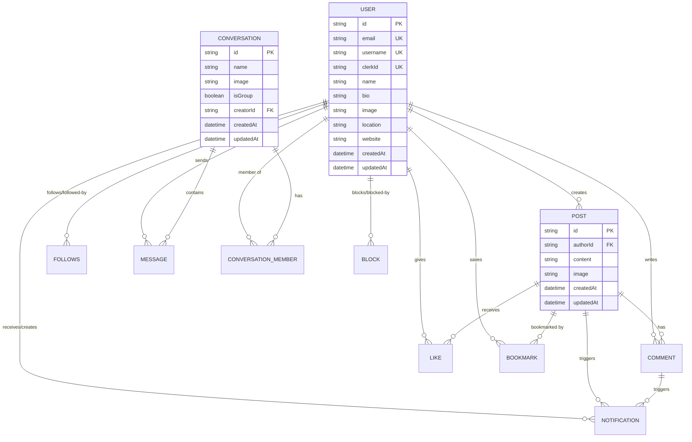

# HolbiZone

> Une plateforme de réseau social moderne pour la communauté Holberton

[](https://nextjs.org/)
[](https://www.typescriptlang.org/)
[](https://www.prisma.io/)
[](https://tailwindcss.com/)

## 📖 À propos du projet

**HolbiZone** est une plateforme de réseau social moderne conçue pour rassembler la communauté Holberton. Ce projet est né d'un besoin concret : **la migration de l'ancien réseau Slack vers Discord**.

### La genèse du projet

Lorsque la communauté Holberton a migré de Slack vers Discord, tous les membres n'étaient pas à l'aise avec Discord ou ne savaient pas l'utiliser. **HolbiZone** a été créé pour :

- Offrir une **alternative web intuitive** à Discord
- Donner un **renouveau** à la communauté avec une plateforme moderne
- Créer un **espace centralisé** où étudiants et alumni peuvent échanger
- Fournir une **interface accessible** pour ceux qui ne maîtrisent pas Discord

L'objectif principal est de maintenir la communauté connectée à travers une plateforme web performante, intuitive et moderne.

## 🎯 Pourquoi ces technologies ?

La stack technique a été soigneusement choisie sur la base de **mon expertise personnelle** et de **mon expérience** avec ces outils. Ce sont des technologies que **j'utilise régulièrement dans mes projets**, ce qui me permet de :

- ✅ **Développer rapidement et efficacement** grâce à ma maîtrise
- ✅ **Appliquer les meilleures pratiques** que je connais bien
- ✅ **Garantir une maintenance optimale** du code
- ✅ **Assurer l'évolutivité** du projet sur le long terme
- ✅ **Résoudre les problèmes rapidement** grâce à mon expérience

**Cette stack représente mon écosystème de développement de prédilection** - les outils avec lesquels je me sens le plus à l'aise et productif.

## 🏗️ Architecture Globale

HolbiZone suit une **architecture en couches** moderne basée sur Next.js 14 avec le pattern **Server-Side Rendering (SSR)** et **Server Actions**.

```
┌─────────────────────────────────────────────────────────┐
│                    👤 UTILISATEUR                        │
└────────────────────┬────────────────────────────────────┘
                     │
                     ▼
┌─────────────────────────────────────────────────────────┐
│                  🎨 FRONTEND (Client)                   │
│  ┌──────────────────────────────────────────────────┐  │
│  │  React Components (TSX)                          │  │
│  │  • Server Components (fetch data)                │  │
│  │  • Client Components (interactivity)             │  │
│  │  • UI Components (Shadcn/UI)                     │  │
│  └──────────────────────────────────────────────────┘  │
└────────────────────┬────────────────────────────────────┘
                     │
                     ▼
┌─────────────────────────────────────────────────────────┐
│                ⚡ NEXT.JS APP ROUTER                     │
│  ┌──────────────────────────────────────────────────┐  │
│  │  • Page Routes (app/)                            │  │
│  │  • API Routes (app/api/)                         │  │
│  │  • Server Actions (actions/)                     │  │
│  │  • Middleware (middleware.ts)                    │  │
│  └──────────────────────────────────────────────────┘  │
└─────┬──────────────────────────┬────────────────────────┘
      │                          │
      ▼                          ▼
┌──────────────┐        ┌───────────────────┐
│ 🔐 CLERK     │        │ 📡 SERVER ACTIONS │
│ • Auth       │        │ • user.action     │
│ • Session    │        │ • post.action     │
│ • Webhooks   │        │ • message.action  │
└──────────────┘        └─────────┬─────────┘
                                  │
                                  ▼
                        ┌──────────────────┐
                        │ 💾 PRISMA ORM    │
                        │ • Type-safe      │
                        │ • Migrations     │
                        │ • Relations      │
                        └─────────┬────────┘
                                  │
                                  ▼
                        ┌──────────────────┐
                        │ 🐘 POSTGRESQL    │
                        │ (Database)       │
                        └──────────────────┘

┌─────────────────────────────────────────────────────────┐
│              🌐 SERVICES EXTERNES                       │
│  • UploadThing (Upload fichiers)                       │
│  • Pusher (Messages temps réel)                         │
│  • Upstash Redis (Rate limiting & Cache)                │
└─────────────────────────────────────────────────────────┘
```

### Flux de Données

#### 📖 Lecture de données (Read)
```
1. User visite une page
2. Server Component s'exécute
3. Fetch des données via Server Action
4. Prisma query → PostgreSQL
5. SSR : HTML généré côté serveur
6. Hydration côté client
7. Affichage dans le navigateur
```

#### ✍️ Écriture de données (Write)
```
1. User interagit (ex: like un post)
2. Optimistic update (UI instantanée)
3. Server Action appelée
4. Vérification auth (Clerk)
5. Validation (Zod)
6. Transaction Prisma → PostgreSQL
7. revalidatePath() → Cache invalidé
8. UI automatiquement synchronisée
```

---

## 📚 Stack Technique

### Frontend
- **Next.js 14** - Framework React avec App Router
- **TypeScript** - Typage statique pour plus de robustesse
- **Tailwind CSS** - Framework CSS utility-first
- **Shadcn/ui** - Composants UI avec Radix UI
- **Lucide React** - Icônes modernes
- **next-themes** - Gestion du dark mode

### Backend
- **Next.js Server Actions** - API serverless
- **Prisma** - ORM moderne pour la gestion de base de données
- **PostgreSQL** - Base de données relationnelle
- **Zod** - Validation des données

### Services Tiers
- **Clerk** - Authentification et gestion des utilisateurs
- **UploadThing** - Upload et gestion des images
- **Pusher** - Messagerie en temps réel
- **Upstash Redis** - Rate limiting et cache

### Sécurité
- **DOMPurify** - Sanitization HTML (protection XSS)
- **Upstash Rate Limit** - Protection contre les abus
- **Middleware Clerk** - Protection des routes

### DevOps & Tests
- **Vitest** - Framework de tests unitaires et d'intégration
- **Testing Library** - Tests de composants React
- **MSW** - Mock des requêtes API pour les tests
- **Bundle Analyzer** - Analyse de la taille du bundle

📖 **Documentation complète** : [Stack Technique Détaillée](./Documentation/01-ARCHITECTURE/01-tech-stack.md)

## Fonctionnalités Principales

### Réseau Social
- Publication de posts avec texte et images
- Système de likes et commentaires
- Fil d'actualité personnalisé
- Système de bookmarks

### Profils Utilisateurs
- Profils personnalisables (bio, photo, localisation, site web)
- Système de follow/unfollow
- Historique des publications
- Statistiques (followers, following, posts)

### Messagerie
- Conversations privées en temps réel
- Support des messages groupés
- Partage d'images dans les messages
- Indicateurs de messages non lus

### Notifications
- Notifications en temps réel (likes, commentaires, follows)
- Centre de notifications centralisé
- Badge de comptage des notifications non lues

### Sécurité & Modération
- Système de blocage d'utilisateurs
- Rate limiting pour prévenir les abus
- Validation des données avec Zod
- Sanitization du contenu (DOMPurify)
- Protection CSRF et permissions strictes

### Recherche & Découverte
- Recherche d'utilisateurs
- Page Explorer pour découvrir du contenu
- Suggestions de personnes à suivre

## 📁 Structure du Projet

HolbiZone suit une architecture **modulaire et organisée** selon les conventions Next.js 14.

```
holbihub/
├── 📂 prisma/
│   ├── schema.prisma              # Schéma de base de données
│   └── migrations/                # Historique des migrations
│
├── 📂 src/
│   ├── 📂 actions/                # Server Actions (Logique métier)
│   │   ├── user.action.ts        # Gestion utilisateurs
│   │   ├── post.action.ts        # CRUD posts
│   │   ├── profile.action.ts     # Profils & follows
│   │   ├── notification.action.ts # Notifications
│   │   ├── bookmark.action.ts    # Bookmarks
│   │   └── search.action.ts      # Recherche
│   │
│   ├── 📂 app/                    # Next.js App Router
│   │   ├── (routes)/             # Routes de l'application
│   │   │   ├── page.tsx          # Page d'accueil (feed)
│   │   │   ├── profile/[username]/ # Profils dynamiques
│   │   │   ├── posts/[id]/       # Détail d'un post
│   │   │   ├── messages/         # Messagerie
│   │   │   ├── notifications/    # Centre de notifications
│   │   │   ├── explorer/         # Page découverte
│   │   │   ├── bookmarks/        # Posts sauvegardés
│   │   │   └── settings/         # Paramètres
│   │   │
│   │   ├── api/                  # API Routes
│   │   │   └── uploadthing/      # Upload d'images
│   │   │
│   │   ├── layout.tsx            # Layout global
│   │   ├── globals.css           # Styles globaux
│   │   ├── error.tsx             # Page d'erreur
│   │   ├── loading.tsx           # État de chargement
│   │   └── not-found.tsx         # 404
│   │
│   ├── 📂 components/             # Composants React
│   │   ├── ui/                   # Shadcn/UI components
│   │   │   ├── button.tsx
│   │   │   ├── card.tsx
│   │   │   ├── dialog.tsx
│   │   │   ├── avatar.tsx
│   │   │   └── ...
│   │   │
│   │   ├── messages/             # Composants messagerie
│   │   │   ├── ConversationList.tsx
│   │   │   ├── MessageList.tsx
│   │   │   ├── ChatHeader.tsx
│   │   │   └── NewConversationButton.tsx
│   │   │
│   │   ├── skeletons/            # Loading states
│   │   │   ├── PostSkeleton.tsx
│   │   │   ├── UserSkeleton.tsx
│   │   │   └── ...
│   │   │
│   │   ├── CreatePost.tsx        # Création de post
│   │   ├── PostCard.tsx          # Carte de post
│   │   ├── CommentCard.tsx       # Carte de commentaire
│   │   ├── FollowButton.tsx      # Bouton follow
│   │   ├── Navbar.tsx            # Navigation
│   │   └── ...
│   │
│   ├── 📂 lib/                    # Bibliothèques & configurations
│   │   ├── prisma.ts             # Client Prisma singleton
│   │   ├── uploadthing.ts        # Config UploadThing
│   │   ├── pusher.ts             # Config Pusher (temps réel)
│   │   ├── rate-limit.ts         # Rate limiting (Upstash)
│   │   ├── security.ts           # Sécurité & sanitization
│   │   ├── logger.ts             # Logging
│   │   ├── utils.ts              # Utilitaires généraux
│   │   │
│   │   ├── validations/          # Schémas Zod
│   │   │   ├── post.validation.ts
│   │   │   ├── comment.validation.ts
│   │   │   ├── user.validation.ts
│   │   │   ├── message.validation.ts
│   │   │   └── image.ts
│   │   │
│   │   ├── utils/                # Fonctions utilitaires
│   │   │   └── accessibility.ts
│   │   │
│   │   └── __tests__/            # Tests unitaires
│   │       └── validations.test.ts
│   │
│   ├── 📂 types/                  # Types TypeScript
│   │   └── user.ts
│   │
│   └── middleware.ts              # Middleware Clerk (protection routes)
│
├── 📂 Documentation/              # Documentation technique
│   ├── 01-ARCHITECTURE/          # Architecture & design
│   ├── 02-DATABASE/              # Schéma & ERD
│   ├── 03-MODULES/               # Docs par module
│   └── ROADMAP_7NOV.md
│
├── 📂 public/                     # Fichiers statiques
│
├── 📄 package.json                # Dépendances & scripts
├── 📄 tsconfig.json               # Config TypeScript
├── 📄 tailwind.config.ts          # Config Tailwind CSS
├── 📄 next.config.mjs             # Config Next.js
├── 📄 vitest.config.ts            # Config tests
├── 📄 .env.local                  # Variables d'environnement
└── 📄 README.md                   # Documentation principale
```

### Organisation par Pattern

```
📦 Feature-based Organization

Server Actions (Backend Logic)
  └─> src/actions/*.action.ts

Routes (Pages)
  └─> src/app/(routes)/*/page.tsx

Components (UI)
  └─> src/components/*.tsx

Database Models
  └─> prisma/schema.prisma

Validation Schemas
  └─> src/lib/validations/*.validation.ts
```

## Démarrage Rapide

### Prérequis
- Node.js 18+
- PostgreSQL
- Compte Clerk (authentification)
- Compte UploadThing (upload d'images)
- Compte Pusher (messagerie temps réel)

### Installation

1. Cloner le projet
```bash
git clone <repository-url>
cd holbihub
```

2. Installer les dépendances
```bash
npm install
```

3. Configurer les variables d'environnement
```bash
cp .env.example .env
```

Remplir les variables suivantes :
- `DATABASE_URL` - URL de connexion PostgreSQL
- `NEXT_PUBLIC_CLERK_*` - Clés API Clerk
- `UPLOADTHING_*` - Clés API UploadThing
- `PUSHER_*` - Clés API Pusher
- `UPSTASH_*` - Clés Redis pour rate limiting

4. Initialiser la base de données
```bash
npx prisma migrate dev
npx prisma generate
```

5. Lancer le serveur de développement
```bash
npm run dev
```

L'application sera accessible sur [http://localhost:3000](http://localhost:3000)

## Scripts Disponibles

```bash
npm run dev          # Démarrer en mode développement
npm run build        # Build pour la production
npm run start        # Démarrer en mode production
npm run lint         # Vérifier le code avec ESLint
npm run test         # Lancer les tests
npm run test:ui      # Tests avec interface Vitest
npm run test:coverage # Tests avec coverage
npm run analyze      # Analyser la taille du bundle
```

## 🗄️ Base de Données & Modèle de Données

### Architecture de la Base de Données

HolbiZone utilise **PostgreSQL** avec **Prisma ORM** pour une gestion type-safe et performante des données.

```
┌─────────────────────────────────────────────────────────────┐
│                   🗄️ POSTGRESQL DATABASE                    │
│                                                             │
│  ┌──────────────────────────────────────────────────────┐  │
│  │                  📊 Tables Principales                │  │
│  │                                                       │  │
│  │  👤 User              📝 Post           💬 Comment    │  │
│  │  ❤️ Like             👥 Follows         🔔 Notification│ │
│  │  💌 Message          💬 Conversation    📌 Bookmark   │  │
│  │  👥 ConversationMember      🚫 Block                 │  │
│  │                                                       │  │
│  │  • Index optimisés sur toutes les FK                 │  │
│  │  • Contraintes d'intégrité référentielle             │  │
│  │  • Cascade DELETE configuré                          │  │
│  │  • Normalisation 3NF respectée                       │  │
│  └──────────────────────────────────────────────────────┘  │
└─────────────────────────────────────────────────────────────┘
```

### Modèles de Données (11 tables)

| Modèle | Description | Clé Primaire | Relations Principales |
|--------|-------------|--------------|----------------------|
| **User** | Profils utilisateurs avec Clerk | `id` (CUID) | Posts, Comments, Likes, Follows, Messages |
| **Post** | Publications avec texte/images | `id` (CUID) | Author, Comments, Likes, Notifications |
| **Comment** | Commentaires sur les posts | `id` (CUID) | Author, Post, Notifications |
| **Like** | Likes sur les posts | `id` (CUID) | User, Post (unique constraint) |
| **Follows** | Relations de suivi (M:N) | Composite `[followerId, followingId]` | Follower, Following |
| **Notification** | Notifications système | `id` (CUID) | User (receiver), Creator, Post, Comment |
| **Conversation** | Conversations privées/groupes | `id` (CUID) | Members, Messages, Creator |
| **ConversationMember** | Membres des conversations | `id` (CUID) | User, Conversation (unique) |
| **Message** | Messages en temps réel | `id` (CUID) | Sender, Conversation |
| **Bookmark** | Posts sauvegardés | `id` (CUID) | User, Post (unique constraint) |
| **Block** | Utilisateurs bloqués | `id` (CUID) | Blocker, Blocked (unique constraint) |

### Diagramme ERD (Entity-Relationship Diagram)



### Relations Clés

#### 🔗 Relations 1:N (One-to-Many)
- User → Posts, Comments, Likes, Messages, Notifications
- Post → Comments, Likes, Notifications
- Conversation → Messages, Members

#### 🔗 Relations M:N (Many-to-Many)
- User ↔ User (via **Follows**) : Système de suivi
- User ↔ Conversation (via **ConversationMember**) : Messagerie

#### 🔗 Relations Auto-référencées
- **Follows** : Un utilisateur suit un autre utilisateur
- **Block** : Un utilisateur bloque un autre utilisateur

### Cascade & Contraintes

```typescript
// Suppression en cascade configurée
DELETE User
  → DELETE Posts
    → DELETE Comments (sur ces posts)
    → DELETE Likes (sur ces posts)
    → DELETE Notifications (liées)
  → DELETE Comments (écrits par ce user)
  → DELETE Likes (donnés par ce user)
  → DELETE Messages (envoyés)
  → DELETE Follows (relations)
  → DELETE Bookmarks, Blocks
```

### Index & Performances

```sql
-- Index composites pour optimisation
CREATE INDEX idx_comment_author_post ON Comment(authorId, postId);
CREATE INDEX idx_like_user_post ON Like(userId, postId);
CREATE INDEX idx_notification ON Notification(userId, createdAt);
CREATE INDEX idx_message ON Message(conversationId, createdAt);
```

📖 **Documentation complète** :
- [Schéma Prisma](./prisma/schema.prisma)
- [Diagramme ERD détaillé](./Documentation/02-DATABASE/01-erd.md)
- [Documentation du schéma](./Documentation/02-DATABASE/00-schema.md)

## 📚 Documentation Technique Complète

Une documentation technique exhaustive est disponible dans le dossier [Documentation/](./Documentation/). Elle couvre tous les aspects du projet :

### 📂 Structure de la Documentation

```
Documentation/
├── 01-ARCHITECTURE/
│   ├── 00-overview.md              # Vue d'ensemble de l'architecture
│   ├── 01-tech-stack.md            # Stack technique détaillée
│   └── 02-security-architecture.md # Architecture de sécurité
│
├── 02-DATABASE/
│   ├── 00-schema.md                # Documentation du schéma
│   └── 01-erd.md                   # Diagramme ERD complet
│
├── 03-MODULES/
│   ├── 01-USER/                    # Module utilisateur
│   ├── 02-POST/                    # Module posts
│   ├── 03-COMMENT/                 # Module commentaires
│   ├── 04-LIKE/                    # Module likes
│   ├── 05-FOLLOW/                  # Module follows
│   ├── 06-NOTIFICATION/            # Module notifications
│   ├── 07-MESSAGE/                 # Module messagerie
│   ├── 08-ZOD/                     # Validations Zod
│   ├── 09-SECURITY/                # Sécurité
│   ├── 10-Blockage/                # Système de blocage
│   └── 11-TEST/                    # Tests
│
└── ROADMAP_7NOV.md                 # Roadmap du projet
```

### 📖 Guides Disponibles

- **Architecture** : Diagrammes, patterns, flux de données
- **Base de données** : Schéma Prisma, relations, migrations, ERD
- **Modules fonctionnels** : Documentation détaillée de chaque feature
- **API & Server Actions** : Endpoints, paramètres, exemples
- **Authentification** : Intégration Clerk, gestion des sessions
- **Sécurité** : Rate limiting, validation, sanitization
- **Tests** : Tests unitaires et d'intégration avec Vitest

## 🚀 Fonctionnalités Techniques Avancées

### Performance & Optimisation
- ⚡ **Server Components** optimisés pour réduire le JavaScript côté client
- ⚡ **Client Components** avec lazy loading et dynamic imports
- ⚡ **Optimistic Updates** pour une UX fluide et instantanée
- ⚡ **Caching intelligent** avec Next.js et revalidation automatique
- ⚡ **Bundle Analyzer** intégré pour surveiller la taille du bundle

### Expérience Utilisateur
- 📱 **Responsive Design** (Mobile-first approach)
- 🌓 **Dark Mode / Light Mode** avec next-themes
- ⏳ **Loading states** élégants avec Skeletons
- 🔄 **Infinite Scroll** (à implémenter)
- 🎯 **Error boundaries** globaux pour une gestion propre des erreurs

### Sécurité & Fiabilité
- 🔒 **Rate limiting** par utilisateur et par IP (Upstash Redis)
- 🛡️ **Validation stricte** avec Zod sur toutes les entrées
- 🧹 **Sanitization HTML** pour prévenir les attaques XSS
- 🔐 **Middleware de protection** des routes privées
- ✅ **Tests automatisés** (unitaires et intégration)

### Architecture Moderne
- 📡 **Server Actions** pour les mutations côté serveur
- 🔌 **Route Handlers** pour les APIs REST
- 🎭 **Server/Client Components** séparation claire
- 📦 **Prisma ORM** avec types TypeScript générés
- 🔄 **Webhooks Clerk** pour la synchronisation utilisateur

## 🧪 Tests

Le projet dispose d'une **suite de tests complète** avec Vitest :

### Types de tests
- ✅ **Tests unitaires** : Utilitaires, validations Zod, fonctions helpers
- ✅ **Tests d'intégration** : Flows complets (auth, posts, comments, messages, follows)
- ✅ **Coverage** : Rapport de couverture de code
- ✅ **UI de tests** : Interface Vitest pour visualiser les tests

### Commandes de test

```bash
npm run test              # Lancer tous les tests
npm run test:ui           # Interface graphique Vitest
npm run test:coverage     # Tests avec rapport de couverture
```

### Couverture actuelle

```
src/lib/__tests__/validations.test.ts  # Tests des schémas Zod
- Validation des posts, commentaires, messages
- Validation des images (taille, format)
- Validation des profils utilisateurs
```

## 🤝 Contribution

Les contributions sont les bienvenues ! Ce projet suit les standards de code modernes et les meilleures pratiques.

### Comment contribuer ?
1. Fork le projet
2. Créer une branche pour votre feature (`git checkout -b feature/AmazingFeature`)
3. Commit vos changements (`git commit -m 'Add some AmazingFeature'`)
4. Push vers la branche (`git push origin feature/AmazingFeature`)
5. Ouvrir une Pull Request

Pour plus de détails, consultez le [guide de contribution](./Documentation/06-GUIDES/04-contributing.md).

## 📝 Licence

Ce projet est **privé** et destiné exclusivement à la **communauté Holberton**.

---

## 📞 Support & Contact

Pour toute question ou suggestion :
- Consultez la [Documentation technique](./Documentation/)
- Ouvrez une issue sur le repository
- Contactez l'équipe de développement

---

<div align="center">

**Version**: 0.1.0
**Dernière mise à jour**: Janvier 2025

**Développé avec passion 💙 pour la communauté Holberton**

*HolbiZone - Connecter la communauté, une feature à la fois.*

</div>
